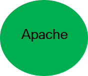
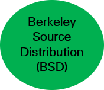
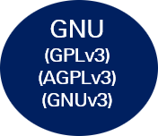
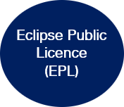

# Open source 

Au Canada et dans d’autres pays, le code source d'un logiciel est protégé par le droit d'auteur en tant qu'œuvre littéraire. C'est pourquoi les licences de codes ont été créées dans l'optique d'octroyer aux utilisateurs du code les droits d'utiliser, de distribuer et de modifier le code. Un code sous licence libre octroie généralement d'emblée ces permissions.

```{image} /images/Niveau_restriction_licences_vxx.png
:alt: Les 5 types de licences pour le code
:width: 700px
:align: center
```

Les licences ouvertes plus utilisées sont du type Permissives ou Copyleft. 

Les licences [GNU](https://www.gnu.org/licenses/gpl-3.0.fr.html), très connues, sont du type «Copy left». Elles imposent de mettre la même licence dans les produits qui ont utilisé la totalité ou une partie de leur code. 

Les licences permissives, qui sont les plus utilisées dans le monde du code ouvert, imposent principalement la citation de l’auteur du code. Toutefois, chaque licence a ses particularités. 

Dans le contexte de création de REL, il est voulu que le code soit hautement accessible et sans contraintes, nous proposons donc la licence [MIT](https://opensource.org/license/MIT) comme la meilleure option.


:::{table} Licences permissives
:label: tbl:areas-html2

<table>
   <tr>
      <th colspan="3" align="center">Permissives: Peu de restrictions ou d'exigences pour la distribution ou la modification du logiciel</th>
   </tr>
   <tr>
      <td align="right"><a href="https://choosealicense.com/licenses/apache-2.0/" target="_blank"></td></a>
      <td align="right"><a href="https://choosealicense.com/licenses/mit/" target="_blank"></td></a>
      <td align="right"><a href="https://choosealicense.com/licenses/bsd-3-clause" target="_blank"></td></a>
   </tr>
</table>
:::

:::{table} Licences Copy Left
:label: tbl:areas-html3

<table>
   <tr>
      <th colspan="3" align="center">Copy Left: Le code peut être distribué ou modifié mais le code résultant doit être distribué sous la même licence</th>
   </tr>
   <tr>
      <td align="right"><a href="https://choosealicense.com/licenses/agpl-3.0/" target="_blank"></td></a>
      <td align="right"><a href="https://choosealicense.com/licenses/mpl-2.0/" target="_blank"></td></a>
      <td align="right"><a href="https://choosealicense.com/licenses/epl-2.0" target="_blank"></td></a>
   </tr>
</table>
:::

Il existe plus de 200 licences ouvertes pour le code. Pour plus d’information sur ces licences pour le code: [Choose an open source license](http://choosealicense.com/)
